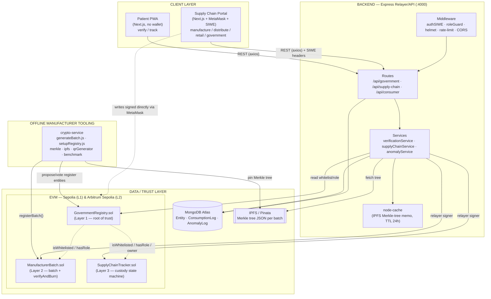
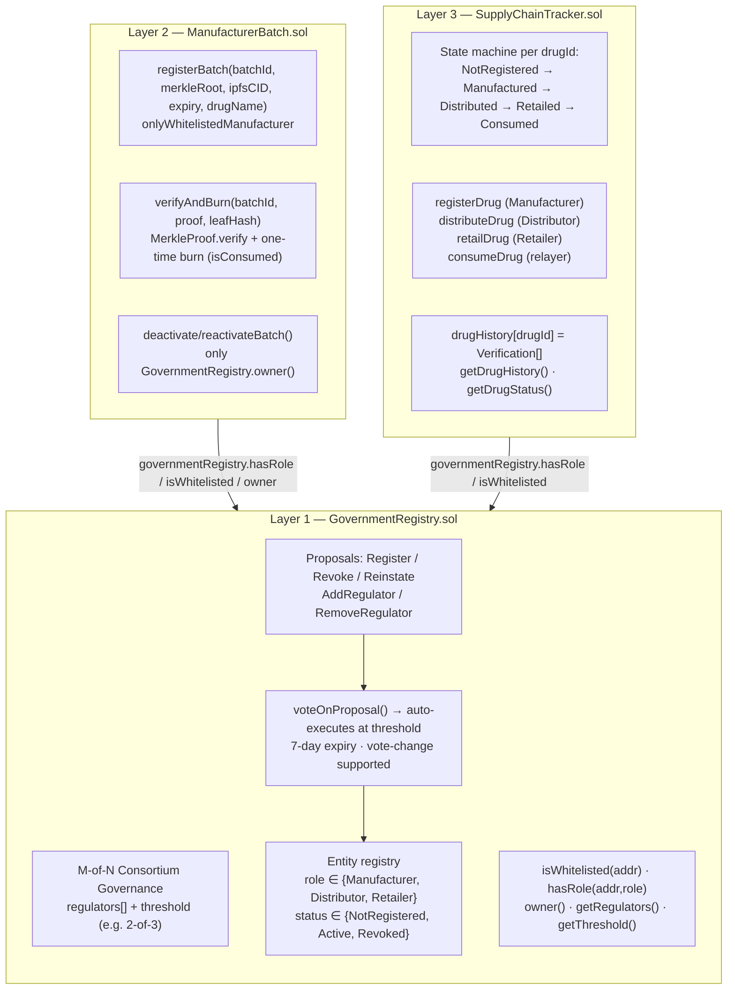
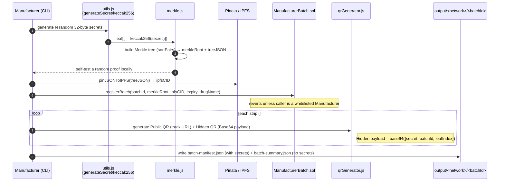
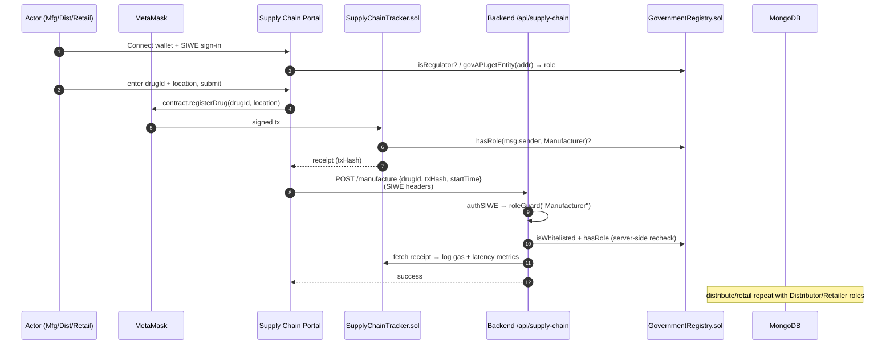
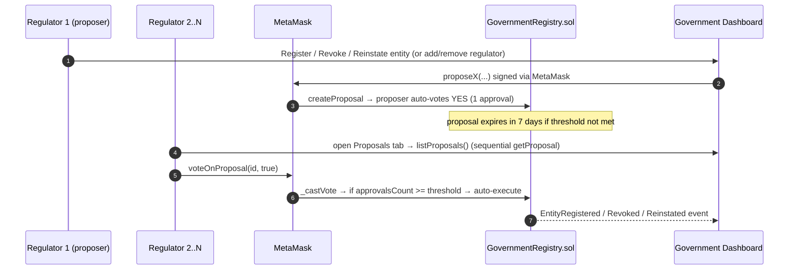
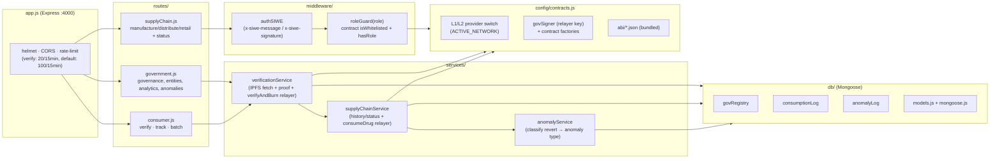
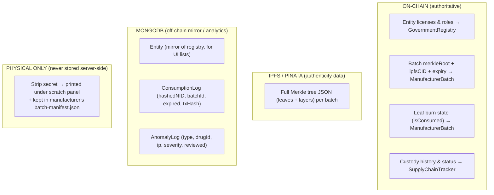
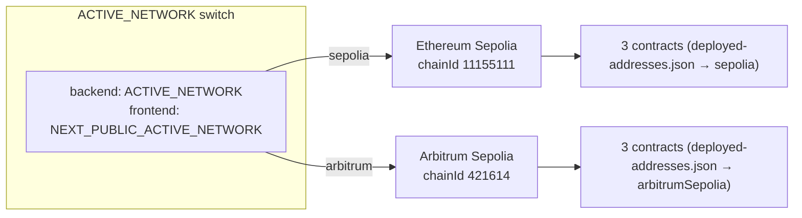
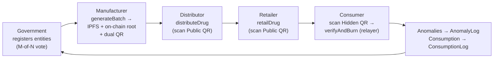

# PharmaChain — Blockchain Anti-Counterfeit System Architecture

> A multi-layer pharmaceutical anti-counterfeiting platform combining a 3-contract
> on-chain trust hierarchy, off-chain cryptographic batch tooling, a relayer backend,
> a B2B supply-chain portal, and a consumer PWA. Deployed dual-network on
> **Ethereum Sepolia (L1)** and **Arbitrum Sepolia (L2)**.

This document is reverse-engineered directly from the source code (not the READMEs).

---

## 1. System at a Glance — The Five Modules

| Module | Path | Stack | Role |
|--------|------|-------|------|
| **Smart Contracts** | `blockchain/` | Hardhat, Solidity `^0.8.20`, OpenZeppelin `^5` | On-chain root of trust, batch registry, custody tracker |
| **Crypto Service** | `crypto-service/` | Node.js scripts, ethers v6, merkletreejs, Pinata SDK, qrcode | Off-line manufacturer tooling: secrets → Merkle tree → IPFS → on-chain batch → dual QR codes |
| **Backend (Relayer/API)** | `backend/` | Express 4, ethers v6, Mongoose/MongoDB, SIWE, node-cache | REST API, gasless relayer for consumers, SIWE auth, anomaly + consumption logging |
| **Supply Chain Portal** | `supply-chain-portal/` | Next.js (App Router), ethers v6, MetaMask, SIWE, Zustand | B2B dApp for Manufacturer / Distributor / Retailer / Government |
| **Patient PWA** | `patient-pwa/` | Next.js (App Router), ethers v6 (browser hashing only) | Consumer verification + tracking (no wallet) |

---

## 2. High-Level Architecture



---

## 3. The On-Chain Trust Hierarchy (3 Contracts)

All three contracts are deployed per-network. Addresses live in
`blockchain/deployed-addresses.json` (keyed by `sepolia` / `arbitrumSepolia`).
`ManufacturerBatch` and `SupplyChainTracker` both hold an **immutable reference**
to `GovernmentRegistry` and delegate every authorization check to it.



**Key security properties enforced on-chain:**
- **Single root of trust** — only `GovernmentRegistry`-active entities with the correct role can act.
- **Merkle authenticity** — `merkleRoot` is stored on-chain; the full tree lives on IPFS; proofs are verified with OpenZeppelin `MerkleProof` (sorted pairs).
- **Anti-replay (burn)** — `isConsumed[leafHash]` flips to `true` on first verify; reuse reverts with `StripAlreadyConsumed`.
- **Strict custody ordering** — out-of-order transitions revert with `OutOfOrderTransition`.
- **No unilateral power** — entity register/revoke and regulator changes require M-of-N votes.

---

## 4. Batch Generation Flow (crypto-service, run by a Manufacturer)



Each strip ends up with **two QR codes**:
- **Public QR** → `/{appBaseUrl}/track?drugId=...` — safe, on the outside of the pack.
- **Hidden QR** → `/{appBaseUrl}/verify?data=<base64(secret,batchId,leafIndex)>` — under a scratch panel.

---

## 5. Supply Chain Custody Flow (Portal + MetaMask + Backend)

The portal signs the actual state-changing transaction **directly through MetaMask**
(`registerDrug` / `distributeDrug` / `retailDrug`). The backend call afterwards is
for **auth verification, role gating, and metrics logging** — it does not re-sign.



State machine guard: a strip must be `Manufactured` before `distributeDrug`,
`Distributed` before `retailDrug`, etc. — enforced on-chain.

---

## 6. Consumer Verification Flow (PWA — gasless relayer)

The consumer has **no wallet**. The secret is hashed in the browser, and the
backend acts as a **relayer** (signs `verifyAndBurn` with the government key) so
verification is free for the patient.

```mermaid
sequenceDiagram
    autonumber
    participant C as Consumer (PWA)
    participant QD as qrDecoder + crypto (browser)
    participant API as Backend /api/consumer/verify
    participant VS as verificationService
    participant Cache as node-cache
    participant IPFS as Pinata Gateway
    participant MB as ManufacturerBatch.sol
    participant SCT as SupplyChainTracker.sol
    participant DB as MongoDB

    C->>QD: scan Hidden QR → decode base64 payload {secret, batchId, leafIndex}
    QD->>QD: leafHash = keccak256(secret) (local) ; optional hashNID
    C->>API: POST /verify {secret, batchId, leafIndex, drugId, hashedNID}
    API->>VS: verifyStrip(...)
    VS->>MB: getBatch(batchId) → merkleRoot, ipfsCID, expiry, drugName
    VS->>Cache: lookup tree by ipfsCID
    alt cache miss
        VS->>IPFS: fetch Merkle tree JSON
        VS->>Cache: store tree (TTL 24h)
    end
    VS->>VS: rebuild tree → generate Merkle proof for leafIndex
    VS->>MB: verifyAndBurn(batchId, proof, leafHash)
    alt valid & unused
        MB-->>VS: expired? flag + StripVerified event (leaf burned)
        VS->>SCT: consumeDrug(drugId) (relayer signer)
        VS->>DB: appendLog(consumption)
        VS-->>C: AUTHENTIC ✅ (or AUTHENTIC_EXPIRED ⚠️)
    else already burned / bad proof
        MB-->>VS: revert StripAlreadyConsumed / InvalidMerkleProof
        VS->>DB: detectAndLogAnomaly(...) → AnomalyLog
        VS-->>C: ALREADY_USED / FAKE ❌
    end
```

**Result statuses returned to the PWA:** `AUTHENTIC`, `AUTHENTIC_EXPIRED`,
`ALREADY_USED`, `FAKE`.

---

## 7. Governance / Consortium Flow (Government tab)



> The portal reads proposals by **walking proposal IDs sequentially** via
> `getProposal()` rather than `eth_getLogs`, to stay within free-tier RPC
> block-range limits.

---

## 8. Backend Internal Structure



**Network routing:** `config/contracts.js` selects L1 vs L2 via `ACTIVE_NETWORK`
(`sepolia` default or `arbitrum`), choosing the matching RPC URL and contract
addresses. ABIs are bundled in `backend/src/abi/*.json` and refreshed with
`npm run sync-abi`.

---

## 9. Data Stores & Where Each Piece of Truth Lives



Privacy notes from the code:
- The raw **secret** never leaves the consumer device — only `keccak256(secret)` is sent.
- The **NID** is hashed in-browser (`hashNID`) before transmission; only the hash is logged.

---

## 10. Authentication & Authorization Model

| Surface | Mechanism |
|---------|-----------|
| **Portal write actions** | MetaMask signature → on-chain role check in the contract itself |
| **Backend protected routes** | `authSIWE` verifies SIWE message/signature → `roleGuard` re-checks `isWhitelisted` + `hasRole` on `GovernmentRegistry` |
| **Government role** | Derived dynamically from on-chain `getRegulators()` (no hardcoded admin address) |
| **Consumer verify/track** | Public, no auth (gasless relayer); protected only by IP rate-limiting |
| **Batch recall** | Restricted to `GovernmentRegistry.owner()` |

Session state on the client is held in a persisted **Zustand** store (`pharma-auth`
localStorage key) containing wallet address, SIWE message/signature, and resolved role.

---

## 11. Dual-Network Deployment



The same contract set is deployed to both networks, enabling an **L1 vs L2
gas/latency comparison** (the backend prints gas + latency metrics on every
verify/custody action, and `crypto-service/benchmark.js` records CSV/JSON results).

---

## 12. End-to-End Lifecycle Summary


