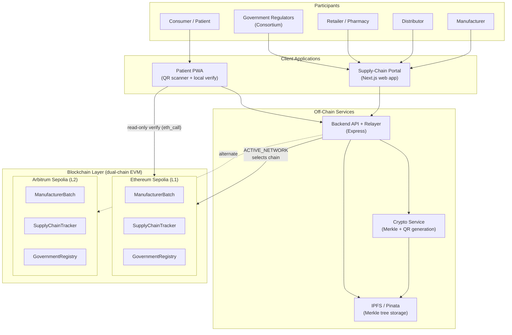
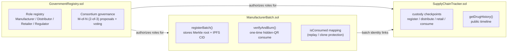
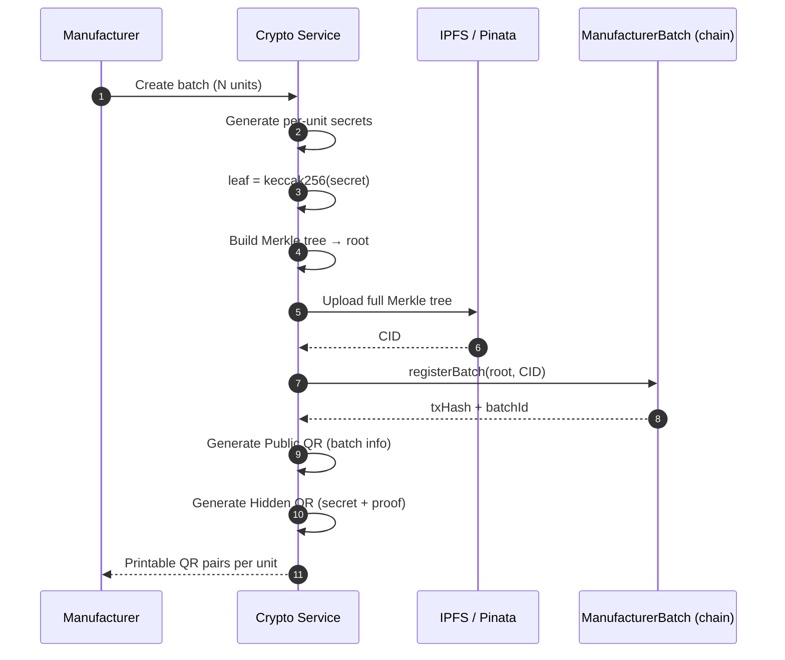
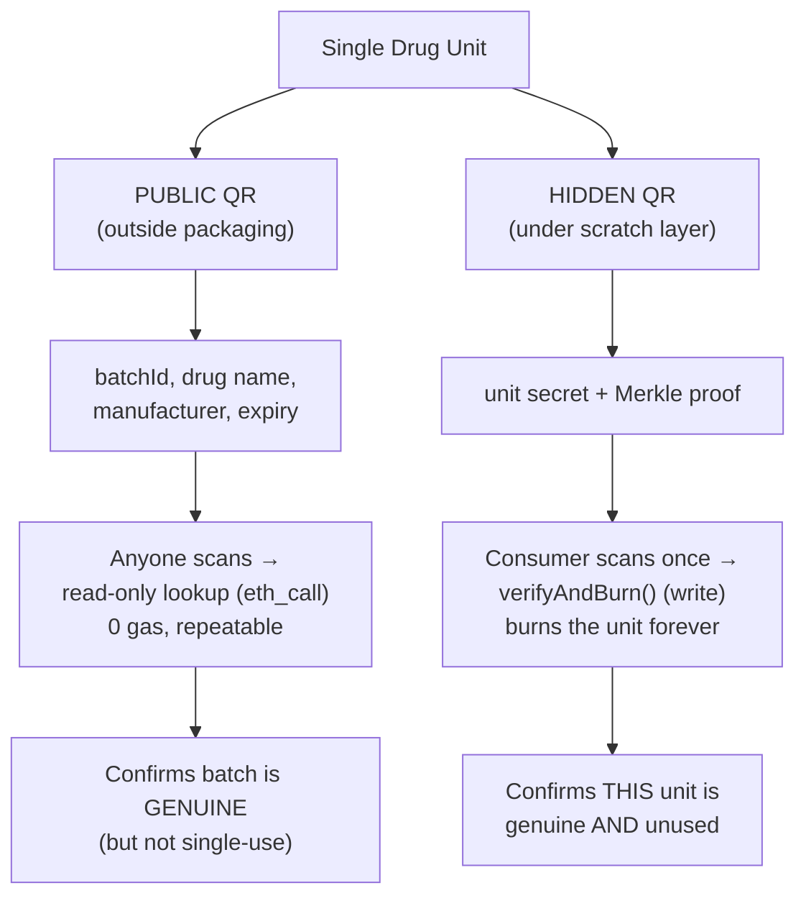
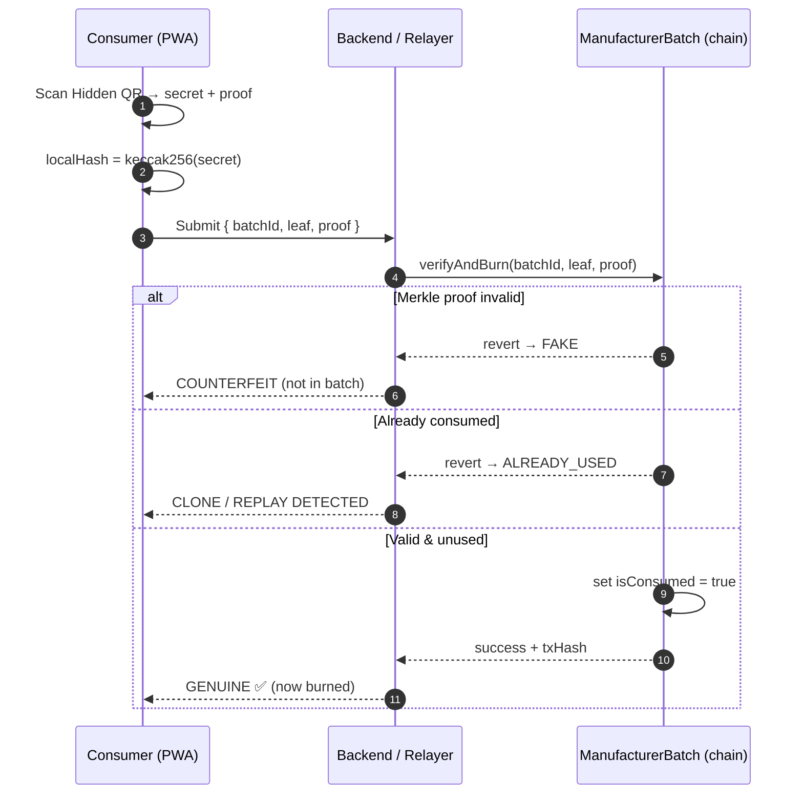
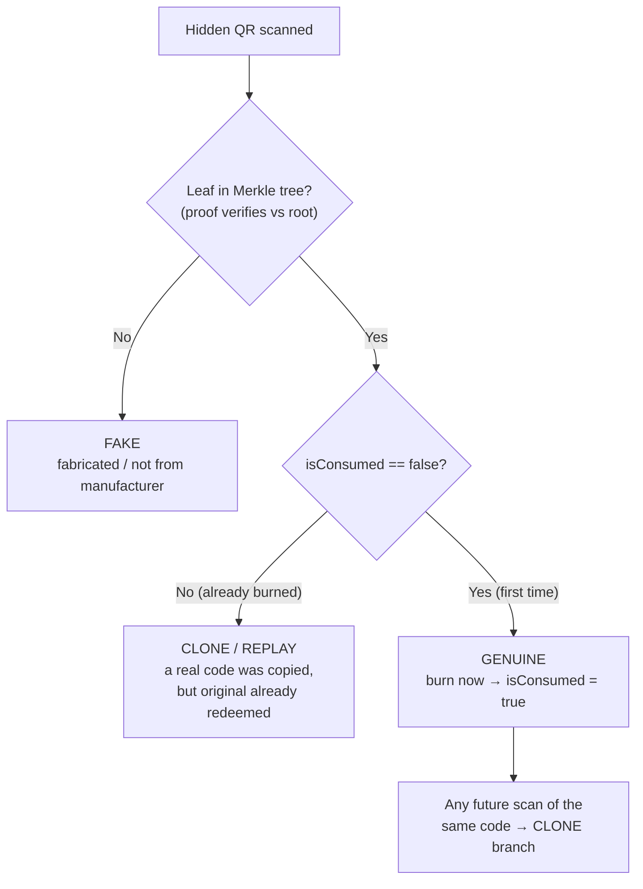
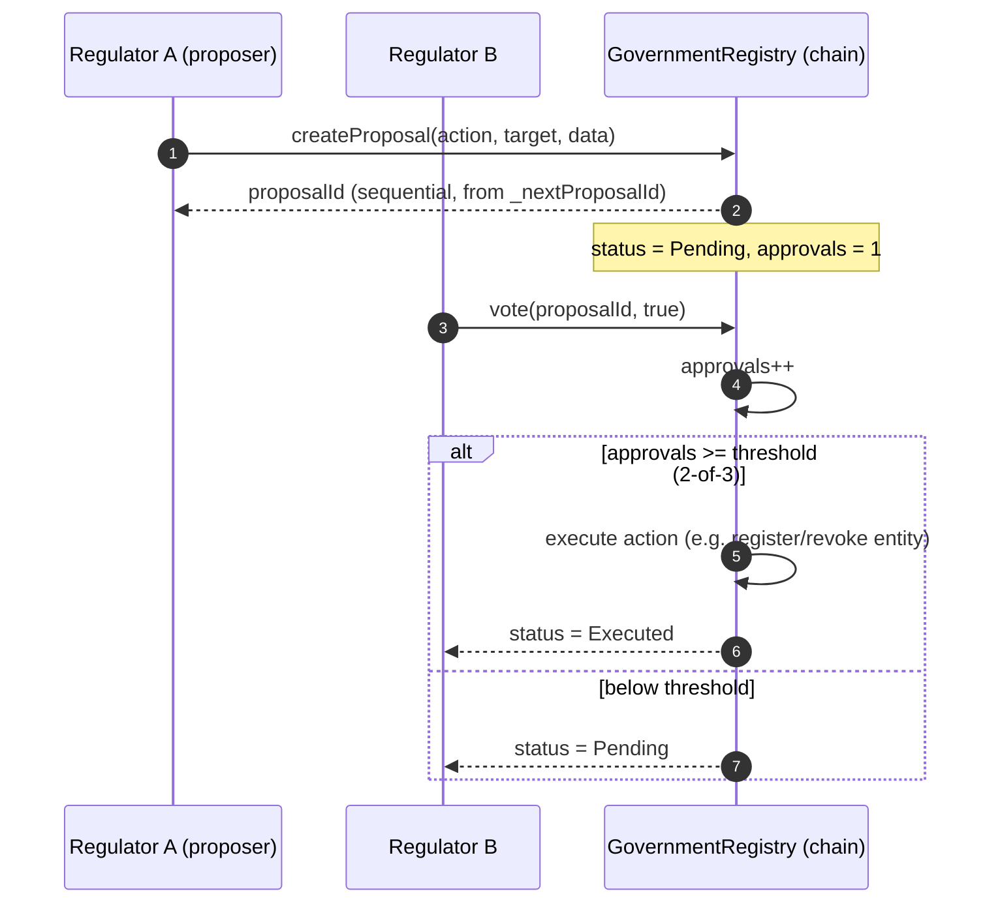
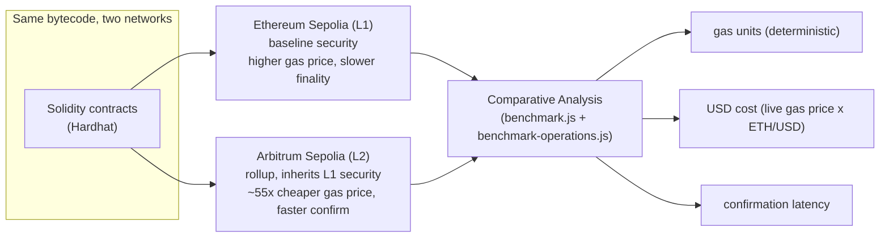
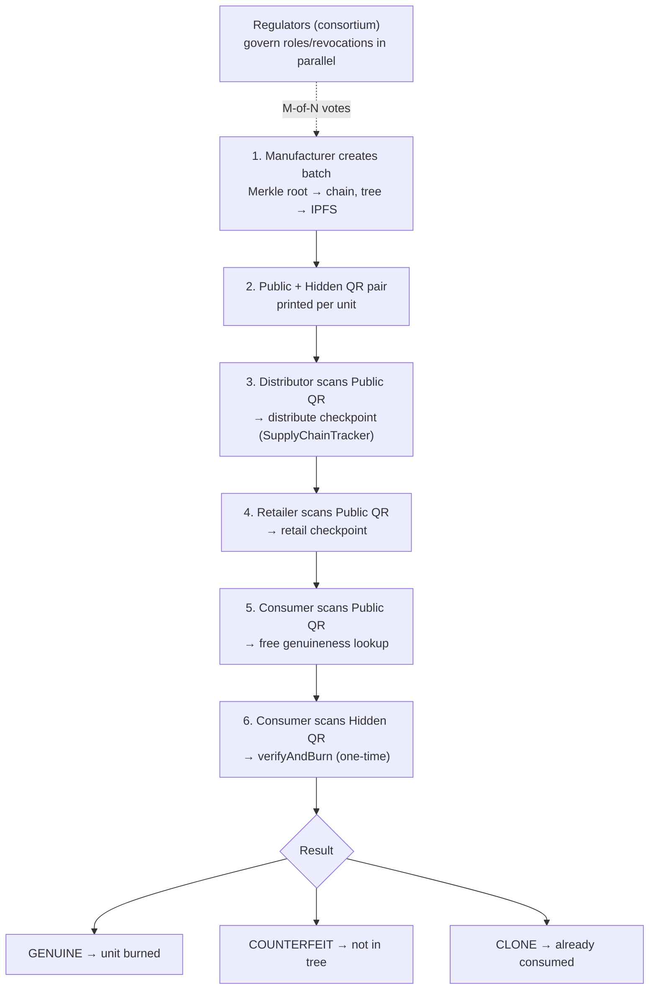

# System Architecture — Pharma Anti-Counterfeit Platform

> Diagrams are written in **Mermaid**. They render automatically on GitHub, in VS Code
> (with a Mermaid extension), and at https://mermaid.live. Every node maps to real code
> in this repository (contracts, `crypto-service`, `backend`, `patient-pwa`).

---

## 1. High-Level System Architecture

---

## 2. Smart-Contract Layer

---

## 3. Batch Creation & QR Generation (Manufacturer)

---

## 4. Two QR Codes — Public vs Hidden

---

## 5. Consumer Verification & Burn (Anti-Clone Core)

---

## 6. Why Only One Copy Can Ever Pass

---

## 7. Consortium Governance (M-of-N Voting)

---

## 8. Dual-Chain Deployment (Sepolia L1 vs Arbitrum L2)

---

## 9. End-to-End Lifecycle (Top to Bottom)

---

## Notes

- **No Hyperledger Fabric** is used. "Consortium" here refers to the on-chain **M-of-N
  governance** in `GovernmentRegistry.sol`, running on public EVM chains.
- The same three contracts are deployed to **both** Ethereum Sepolia and Arbitrum Sepolia;
  `ACTIVE_NETWORK` selects which chain the backend writes to at runtime.
- Anti-clone protection is the combination of **(a)** Merkle-proof membership (blocks fakes)
  and **(b)** the one-time `isConsumed` burn (blocks copies of real codes).
